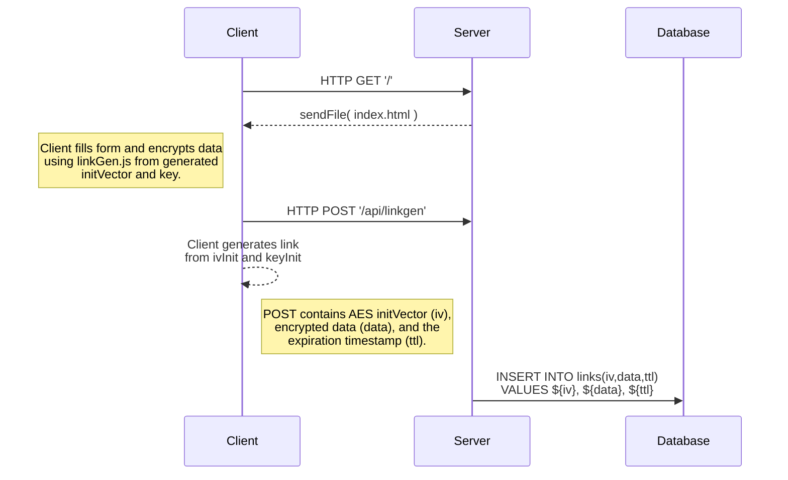
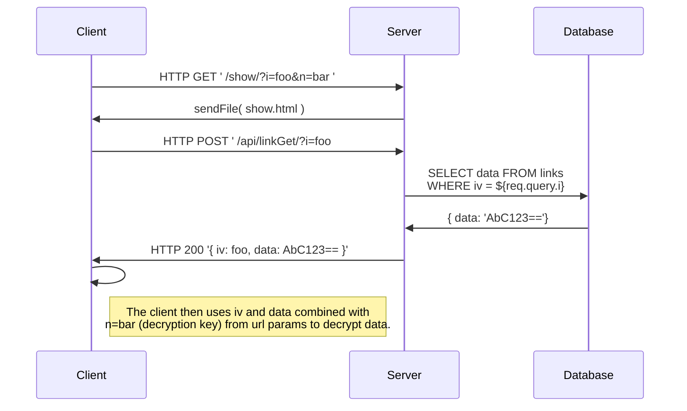

# BurnAfterClicking

## Generating the secret message

```mermaid
sequenceDiagram
Client->> Server: HTTP GET '/'
Server-->> Client: sendFile( index.html )
Note left of Client: Client fills form and encrypts data<br> using linkGen.js from generated<br> initVector and key.

Client->>Server: HTTP POST '/api/linkgen'
Client-->>Client: Client generates link <br>from ivInit and keyInit
Note left of Server: POST contains AES initVector (iv),<br> encrypted data (data), and the <br>expiration timestamp (ttl).
Server->>Database: INSERT INTO links(iv,data,ttl)<br> VALUES ${iv}, ${data}, ${ttl}

```

## Returning the secret message

```mermaid
sequenceDiagram
Client ->> Server: HTTP GET ' /show/?i=foo&n=bar '
Server ->> Client: sendFile( show.html )
Client ->> Server: HTTP POST ' /api/linkGet/?i=foo
Server ->> Database: SELECT data FROM links<br> WHERE iv = ${req.query.i}
Database ->> Server: { data: 'AbC123=='}
Server ->> Client: HTTP 200 '{ iv: foo, data: AbC123== }'
Client ->> Client: 
Note right of Client: The client then uses iv and data combined with <br>n=bar (decryption key) from url params to decrypt data.
```
