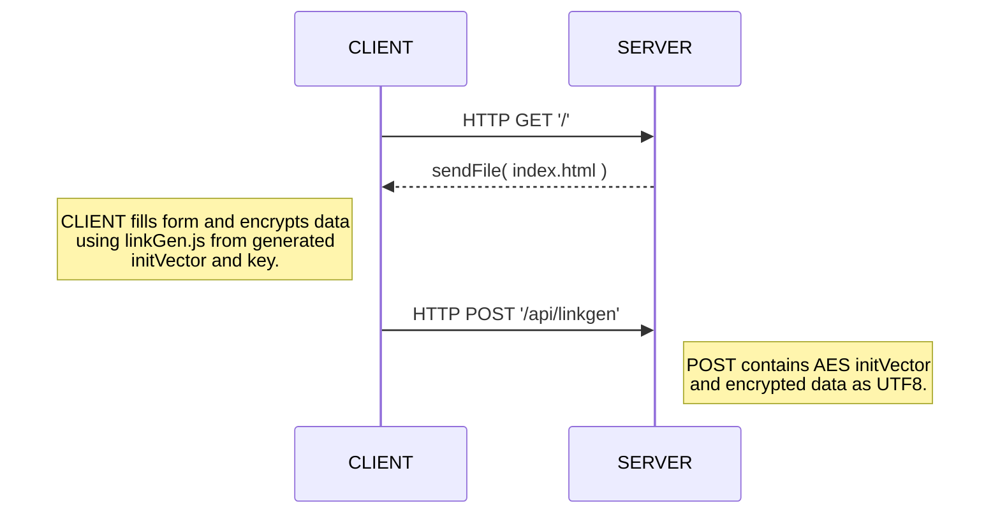

# BurnAfterClicking
 

```mermaid
sequenceDiagram
CLIENT ->> SERVER: HTTP GET '/'
SERVER-->> CLIENT: sendFile( index.html )
Note left of CLIENT: CLIENT fills form and encrypts data<br> using linkGen.js from generated<br> initVector and key.

CLIENT->>SERVER: HTTP POST '/api/linkgen'
Note right of SERVER: POST contains AES initVector <br>and encrypted data as UTF8.
```
